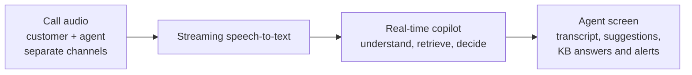
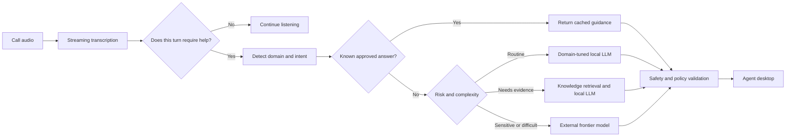
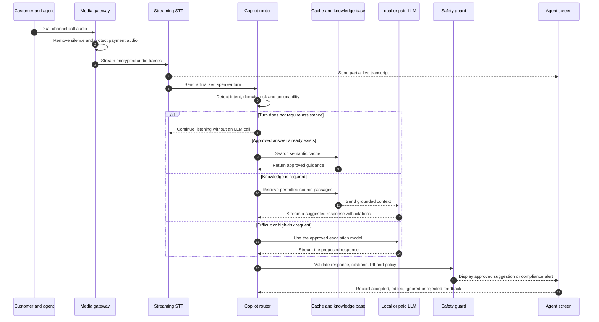
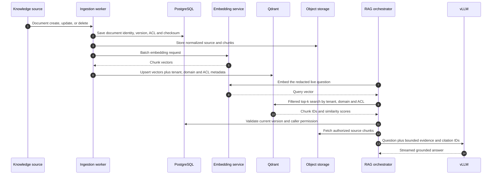

# Agent Voice Pilot

An architecture and proof of concept for an AI assistant that listens to live support calls and gives agents useful, text-based guidance while the conversation is still happening.

The project is built around one principle:

> Use the smallest reliable model for each decision, and reserve expensive models for the few cases that genuinely need them.

## Contents

- [System at a glance](#system-at-a-glance)
- [Product behavior](#what-the-agent-receives)
- [Routing and call execution](#how-an-utterance-becomes-a-suggestion)
- [Models and tenant isolation](#model-selection)
- [Kubernetes deployment](#deployment-blueprint)
- [Scale and capacity](#scale-and-capacity)
- [Economics](#economics)
- [Reliability and security](#reliability-security-and-compliance)
- [Proof of concept](#what-is-implemented-here)
- [Production roadmap](#from-prototype-to-production)

## System at a glance



The system listens to separate customer and agent channels, produces a live transcript, decides whether assistance is needed, and displays guidance without interrupting the conversation.

## The problem

A call-center copilot must respond quickly enough to help during a conversation, understand the company’s domain, protect customer data, and remain affordable across thousands of locations.

Sending complete calls to a general-purpose hosted LLM does not meet those requirements well. It increases network traffic, exposes the system to provider latency and rate limits, and charges premium inference prices for routine questions.

Agent Voice Pilot instead separates the work into specialized stages. Speech recognition, intent detection, retrieval, response generation, and safety checks can then scale independently.

## What the agent receives

The assistant is designed to add information to the agent’s existing desktop rather than speak into the call.

- A live transcript with separate customer and agent turns
- Short suggested responses
- Relevant policy or knowledge-base cards
- Required compliance steps
- Intent, sentiment, and escalation indicators
- Draft notes and a post-call summary

Text is the primary output because it is silent, persistent, scannable, and auditable. It does not compete with the customer’s voice or force the agent to listen to another audio stream.

## How an utterance becomes a suggestion

The LLM is not called for every audio fragment. The system waits for a meaningful customer or agent turn, then makes a sequence of increasingly expensive decisions.



This control loop has four important properties:

1. **No unnecessary generation.** Greetings, acknowledgements, and unfinished turns do not consume LLM capacity.
2. **Repetition becomes an advantage.** Approved answers can be reused for common requests such as refunds, plan changes, or device resets.
3. **Domain knowledge stays isolated.** The selected business domain controls the prompt, adapter, retrieval collection, and compliance policy.
4. **Escalation is deliberate.** A hosted frontier model is a controlled exception for ambiguous, high-risk, or unusually complex cases.

## How one call is executed



The live call continues even if an AI component is unavailable. The system observes a passive copy of the audio, and the agent remains responsible for accepting or rejecting every suggested action.

## Model selection

The architecture is model-agnostic. Each model sits behind a replaceable service boundary and is selected by measured accuracy, latency, license, and operating cost.

| Responsibility | Primary reference choice | Alternative or escalation | Serving location |
|---|---|---|---|
| Voice activity detection | Silero VAD | Equivalent small audio classifier | Site edge or regional CPU |
| Streaming transcription | Parakeet-TDT 0.6B v2 | Whisper large-v3-turbo; paid STT for bursts and long-tail languages | Triton/Riva on regional L4-class GPUs; optional on-site deployment |
| Domain and intent routing | Fine-tuned DeBERTa-v3-small | Rules and embedding similarity for guarded fallback checks | Regional CPU or small GPU |
| Entity and PII detection | GLiNER plus Presidio | Tenant-specific deterministic rules | Regional CPU/small GPU before storage or external calls |
| Sentiment and escalation risk | Fine-tuned DistilRoBERTa | Domain-specific classifier | Regional CPU or small GPU |
| Embeddings | bge-m3 | Re-benchmarked multilingual embedding model | Triton GPU service |
| Reranking | bge-reranker-v2-m3 | Compatible cross-encoder | Triton GPU service |
| Routine live guidance | Llama 3.1 8B Instruct or Qwen2.5-7B with domain LoRA | Paid low-latency model when risk requires escalation | vLLM on regional L40S-class GPUs |
| Complex RAG synthesis | Qwen2.5-14B or equivalent | Frontier reasoning model | Regional vLLM or controlled external API |
| Post-call summary and QA | Quantized Llama 3.3 70B in batches | Frontier Batch API | Off-peak or preemptible batch GPU pool |

Model names are reference candidates, not fixed dependencies. Benchmark accuracy, time-to-first-token, throughput, memory use, languages, safety, and licensing against representative calls every quarter. Prefer permissive licenses where possible, and review every model release before redistribution or production deployment.

### Open versus paid models

| Decision factor | Self-hosted open model | Paid model API |
|---|---|---|
| Best fit | Repetitive, high-volume, latency-sensitive work | Low-volume difficult reasoning and overflow |
| Data control | Full regional control | Contractual controls and zero-retention agreement required |
| Latency | Predictable when served in-region | Network and provider queueing add variance |
| Customization | Full fine-tuning and LoRA support | Provider-dependent |
| Operations | GPU capacity and model lifecycle are internal responsibilities | Provider operates inference |
| Unit economics | Strong when regional GPUs remain highly utilized | Strong for pilots and small or bursty regions |

The practical rule is open-first, not open-only. A new region or small tenant may start with managed APIs, then move steady volume to self-hosting once it can keep a regional fleet utilized.

### Multi-tenancy and domain packs

One shared base model serves many business domains through hot-swappable LoRA adapters. The router selects a complete domain pack rather than only a model:

```text
domain pack = prompt policy
            + LoRA adapter
            + Qdrant collection
            + compliance rules
            + language configuration
            + escalation thresholds
```

- PostgreSQL stores tenant, site, policy, entitlement, model-release, and document-access metadata.
- Qdrant collections are partitioned and filtered by tenant and domain.
- Object-storage prefixes and encryption keys are tenant-scoped.
- Redis keys include region, tenant, and call identifiers and expire automatically.
- Every request is authorized again at retrieval time; selecting a tenant collection is not sufficient by itself.
- Router confidence thresholds are configuration, not hard-coded behavior. Banking and healthcare domains can escalate earlier than low-risk retail workflows.

## Deployment blueprint

The production reference stack runs one Kubernetes cluster per processing region. Each site connects to its nearest healthy region. Direct streaming APIs carry latency-sensitive traffic; Kafka carries durable events for storage, analytics, and post-call processing.

```mermaid
flowchart LR
    classDef edge fill:#e8f4ff,stroke:#2673b8,color:#111
    classDef api fill:#fff3d6,stroke:#b47b00,color:#111
    classDef cpu fill:#ebf8e8,stroke:#39833a,color:#111
    classDef gpu fill:#f4e8ff,stroke:#7545a3,color:#111
    classDef data fill:#ffe9e9,stroke:#a94442,color:#111
    classDef external fill:#f2f2f2,stroke:#666,color:#111

    subgraph SITE[Call-center site]
        PBX[PBX or CCaaS]:::edge
        TAP[SIPREC and RTP media gateway]:::edge
        PRE[VAD, channel split and payment masking]:::edge
        UI[Agent desktop widget]:::edge
        PBX -->|SIPREC: customer plus agent audio| TAP
        TAP --> PRE
    end

    subgraph K8S[Regional Kubernetes cluster]
        direction LR

        subgraph ENTRY[ingress namespace]
            GW[Envoy Gateway and regional load balancer]:::api
            AUTH[Identity, tenant and rate-limit filter]:::api
            WS[Agent WebSocket gateway]:::api
            GW --> AUTH
        end

        subgraph LIVE[live-call namespace - CPU]
            SESSION[Session orchestrator]:::cpu
            STTG[STT stream gateway]:::cpu
            TURN[Turn finalizer and transcript assembler]:::cpu
            PII[PII redaction service]:::cpu
            ROUTER[Intent, domain and risk router]:::cpu
            RAG[RAG orchestrator]:::cpu
            LLMGW[LLM gateway]:::cpu
            GUARD[Output policy guard]:::cpu
            SESSION --> STTG
            TURN --> PII --> ROUTER
            ROUTER -->|knowledge request| RAG
            ROUTER -->|generation request| LLMGW
            RAG --> LLMGW
            LLMGW --> GUARD --> WS
        end

        subgraph GPU[gpu-inference namespace]
            STT[STT model server<br/>Triton plus Parakeet or Whisper]:::gpu
            NLP[Classifier and embedding server<br/>Triton]:::gpu
            LOCAL[Local LLM server<br/>vLLM plus 8B or 14B models and LoRA]:::gpu
            BATCH[Post-call model workers<br/>large model on batch GPU pool]:::gpu
        end

        subgraph STATE[data namespace]
            REDIS[(Redis Cluster<br/>active sessions, locks and cache)]:::data
            PG[(PostgreSQL<br/>tenants, policies, calls and audit index)]:::data
            QD[(Qdrant<br/>tenant and domain vector collections)]:::data
            OBJ[(S3-compatible object storage<br/>documents, models and approved artifacts)]:::data
            KAFKA[(Kafka event bus)]:::data
        end

        subgraph ASYNC[worker namespace]
            WRITER[Transcript and audit writer]:::cpu
            POST[Post-call job coordinator]:::cpu
            INDEX[Knowledge ingestion workers]:::cpu
            ANALYTICS[Analytics event sink]:::cpu
        end

        STTG <-->|bidirectional gRPC audio and partial text| STT
        STTG -->|partial and final transcript| TURN
        ROUTER -->|classification| NLP
        ROUTER <-->|approved semantic cache| REDIS
        RAG -->|embed and rerank| NLP
        RAG <-->|vector search| QD
        RAG -->|document metadata and access policy| PG
        RAG -->|source content| OBJ
        LLMGW -->|OpenAI-compatible streaming API| LOCAL
        SESSION <-->|ephemeral call state| REDIS
        SESSION -->|call and transcript events| KAFKA
        PII -->|redacted transcript events| KAFKA
        GUARD -->|suggestion and audit events| KAFKA
        KAFKA --> WRITER
        KAFKA --> POST
        KAFKA --> ANALYTICS
        WRITER --> PG
        WRITER --> OBJ
        POST --> BATCH
        BATCH --> OBJ
        INDEX -->|upsert vectors| QD
        INDEX --> PG
        INDEX --> OBJ
    end

    subgraph EXT[External and central services]
        IDP[OIDC identity provider]:::external
        CRM[CRM and ticketing APIs]:::external
        KB[Knowledge sources<br/>SharePoint, files and product systems]:::external
        PAID[Approved paid LLM API]:::external
        CONTROL[Central control plane<br/>GitOps, model registry and evaluation]:::external
    end

    PRE -->|TLS WebSocket or gRPC audio| GW
    AUTH --> SESSION
    IDP -->|OIDC and JWKS| AUTH
    WS -->|WebSocket transcript and guidance| UI
    LLMGW -->|redacted high-risk request only| PAID
    POST -->|summary and disposition update| CRM
    KB -->|connector or webhook| INDEX
    CONTROL -->|GitOps config and signed model releases| K8S
```



### Selected infrastructure services

| Layer | Reference service | Responsibility |
|---|---|---|
| Container platform | Kubernetes with separate CPU, real-time GPU, and batch GPU node pools | Scheduling, isolation, health checks, rolling deployment, and autoscaling |
| North-south traffic | Envoy Gateway behind a managed regional load balancer | TLS termination, WebSocket/gRPC routing, request limits, and regional failover |
| Service identity | OIDC for users; workload identity and mTLS for services | Tenant authentication without distributing long-lived credentials |
| Live APIs | gRPC bidirectional streams internally; WebSocket to the agent UI | Low-latency audio, partial transcripts, token streams, and agent updates |
| Event backbone | Kafka with replicated regional brokers | Durable call events, redacted transcript events, audit events, and background jobs |
| Session state | Redis Cluster | Active-call context, short locks, rate counters, and semantic-response cache |
| Relational data | PostgreSQL with regional read replicas and automated backups | Tenants, users, policies, call metadata, model decisions, feedback, and audit indexes |
| Vector data | Qdrant collections partitioned by tenant and domain | Embeddings for RAG and semantic similarity search |
| Blob data | S3-compatible object storage | Source documents, approved answers, model artifacts, and policy-controlled transcripts |
| Speech and NLP serving | NVIDIA Triton Inference Server | Streaming STT, domain classifier, embedding, and reranker models |
| LLM serving | vLLM with an OpenAI-compatible API | Token streaming, continuous batching, quantized models, and domain LoRA adapters |
| Deployment | Argo CD or Flux plus Helm | Reproducible GitOps deployment across regions |
| Observability | OpenTelemetry, Prometheus, Grafana, and a log backend | Traces, metrics, logs, GPU utilization, latency, and per-tenant usage |

Managed equivalents can replace the stateful components: Amazon EKS/MSK/RDS/S3, Azure AKS/Event Hubs/PostgreSQL/Blob Storage, or Google GKE/Managed Kafka/Cloud SQL/Cloud Storage. The application contracts remain the same.

### Live call path

The live path uses direct streaming calls because putting audio frames or generated tokens through a durable queue would add latency and make backpressure harder to control.

1. The PBX or contact-center platform creates a passive SIPREC copy of the customer and agent channels. The AI system is not inserted into the phone path.
2. The site media gateway converts RTP into framed audio, preserves the speaker channel, applies voice activity detection, and stops or masks capture during protected payment entry.
3. The gateway opens a TLS WebSocket or bidirectional gRPC session through Envoy. The identity filter validates the tenant, site, call, and allowed residency region.
4. The session orchestrator assigns a regional session, stores short-lived state in Redis, and connects the stream to the STT gateway.
5. The STT gateway batches audio across calls and streams it to a Triton-hosted speech model. Partial transcripts can be displayed immediately; only finalized turns continue to LLM routing.
6. The transcript assembler joins speaker-labelled turns. The redaction service removes PII before the text is stored, published to Kafka, used for RAG, or sent outside the cluster.
7. The router calls the classifier model to choose the domain, intent, risk level, LoRA adapter, Qdrant collection, and tenant policy. Non-actionable turns end here.
8. Redis is checked for an approved semantic answer. When retrieval is required, the RAG service embeds the question, searches the tenant’s Qdrant collection, checks document permissions in PostgreSQL, and loads the authorized source fragments from object storage.
9. The LLM gateway sends the prompt to the local vLLM server. Only requests that exceed configured confidence or risk thresholds are redacted again and forwarded to the approved paid-model API.
10. The output guard validates citations, prohibited language, PII, and required compliance phrasing. The WebSocket gateway then streams the suggestion to the correct agent desktop.
11. Each important decision is also published as a durable Kafka event, but this happens alongside the response and does not block the live suggestion.

### Where queues and events are used

Kafka is the boundary between the real-time product and work that may be retried or processed later. Events use a schema registry, include `tenant_id`, `region`, `call_id`, `event_id`, `occurred_at`, and `schema_version`, and contain redacted data only.

| Topic | Producer | Consumers | Purpose |
|---|---|---|---|
| `call.lifecycle.v1` | Session orchestrator | Audit writer, analytics | Call started, connected, ended, or failed |
| `transcript.final.v1` | PII redaction service | Transcript writer, analytics, post-call coordinator | Final speaker-labelled and redacted turns |
| `copilot.decision.v1` | Router | Audit writer, evaluation pipeline | Route, confidence, model choice, cache decision, and policy version |
| `copilot.suggestion.v1` | Output guard | Audit writer, feedback service | Validated suggestion, sources, latency, and model version |
| `agent.feedback.v1` | Agent UI service | Evaluation and router-training pipeline | Accepted, edited, ignored, or rejected suggestion |
| `postcall.request.v1` | Post-call coordinator | Batch model workers | Summary, disposition, and QA work after call completion |
| `knowledge.changed.v1` | Knowledge connectors | Chunking and indexing workers | Re-index a created, updated, or deleted source document |
| `deadletter.*` | Kafka consumers | Operations tooling | Events that repeatedly fail validation or processing |

Each consumer stores its own idempotency key in PostgreSQL or Redis. Kafka delivery is treated as at-least-once, so consumers must safely ignore duplicate `event_id` values. Raw audio is not placed on Kafka.

### RAG ingestion and query flow

RAG has a write path and a read path; mixing them in one service makes access control and re-indexing difficult.



PostgreSQL is the source of truth for document identity, version, ownership, access policy, and deletion state. Qdrant stores searchable vectors and filter metadata, not the authoritative document record. Object storage holds the normalized content. Deleting a document first marks it unavailable in PostgreSQL, then an idempotent event removes its vectors and blobs.

### API and protocol boundaries

| From | To | Protocol | Example operation |
|---|---|---|---|
| Site media gateway | Regional ingress | TLS WebSocket or bidirectional gRPC | `StreamCallAudio` |
| Agent desktop | WebSocket gateway | WebSocket with OIDC access token | Subscribe to transcript and suggestion events for one call |
| Session orchestrator | STT gateway | Bidirectional gRPC | Audio frames in; partial/final transcript frames out |
| Router | Triton NLP server | gRPC | Domain, intent, risk, embedding, and reranking inference |
| RAG service | Qdrant | gRPC | Filtered vector search and batch upsert |
| Application services | PostgreSQL | PostgreSQL wire protocol through a connection pooler | Transactional metadata and audit indexes |
| Application services | Redis | TLS RESP | Session state, cache, locks, and counters |
| LLM gateway | vLLM | Internal OpenAI-compatible HTTP streaming API | `/v1/chat/completions` |
| LLM gateway | Paid provider | Provider HTTPS API through controlled egress | Redacted escalation request |
| Services and workers | Kafka | TLS SASL Kafka protocol | Publish and consume versioned events |
| Post-call worker | CRM | REST or vendor SDK | Write summary, disposition, and agent-approved notes |

### Kubernetes workload layout

- **CPU node pool:** gateways, session orchestration, routing, redaction, RAG orchestration, Kafka consumers, and API services.
- **Real-time GPU node pool:** STT, embeddings, reranking, and 8B/14B vLLM pods. Use taints, tolerations, topology spread, and priority classes so batch jobs cannot evict live inference.
- **Batch GPU node pool:** post-call models, evaluation, and fine-tuning. This pool may use preemptible capacity because all work is checkpointable and queue-backed.
- **Stateful services:** use managed PostgreSQL, Kafka, Redis, and object storage where available. If Qdrant runs in-cluster, use dedicated stateful nodes, persistent volumes, anti-affinity, snapshots, and restore testing.
- **Autoscaling:** HPA/KEDA scales stateless services from request rate, Kafka lag, and active sessions. GPU model replicas scale from queue depth, tokens per second, and time-to-first-token rather than CPU usage.
- **Isolation:** namespaces, network policies, workload identity, secrets from a managed vault, per-tenant authorization, and separate regional encryption keys restrict the blast radius.
- **Release safety:** signed images, admission policies, canary model deployments, automatic rollback, and shadow evaluation prevent an untested model from replacing the live fleet globally.

### Data ownership and retention

| Data | System of record | Typical retention rule |
|---|---|---|
| Tenant, site, user, policy, and model configuration | PostgreSQL | Tenant lifetime plus audit requirement |
| Active transcript window and session state | Redis | Minutes to hours; expires automatically |
| Final redacted transcript and call metadata | PostgreSQL plus object storage | Policy-driven; for example 30–90 days |
| Raw audio | Regional object storage only when explicitly required | Disabled by default or shortest permitted period |
| Knowledge documents | Object storage; metadata and ACL in PostgreSQL | Until source deletion or replacement |
| Embeddings | Qdrant | Same lifecycle as the corresponding document version |
| Model artifacts and LoRA adapters | Versioned object storage and model registry | Retain every deployed or audited version |
| Audit and model-decision events | Kafka during transport; durable analytics/audit store afterward | Compliance-driven and immutable |

No external model receives raw audio. External requests contain only the minimum redacted text and retrieved evidence allowed by tenant policy.

### In each processing region

Regional services perform the latency-sensitive work: transcription, classification, retrieval, LLM inference, and WebSocket delivery to the agent screen. Pooling GPUs across many sites provides better utilization than installing an inference server in every call center.

### In the central platform

The central layer manages tenants, model versions, evaluation, audit policy, and asynchronous analytics. It does not need raw audio from every location. External-model access passes through one gateway so retention rules, redaction, budgets, and provider failures can be managed consistently.

## Scale and capacity

The reference design evaluates a large deployment rather than claiming a measured production result.

| Planning input | Reference value |
|---|---:|
| Locations | 5,000 call centers |
| Peak calls per location | 50 |
| Global peak | 250,000 concurrent calls |
| Typical call length | 6 minutes |
| Annual workload | Approximately 9.5 billion call-minutes |
| Audio format | Independent customer and agent channels |
| Effective STT workload | Approximately 11.4 billion channel-minutes after removing about 40% silence |
| LLM cadence | Approximately 8–15 real-time invocations per typical call, not one per partial transcript |
| Regionalization | Approximately 12–20 processing regions; no region should carry the global fleet |

These figures are sizing inputs. If the real requirement is 5,000 agents rather than 5,000 physical call centers, both the topology and budget change substantially.

### Peak fleet planning

The following figures include approximately 30% headroom and must be replaced with results from the selected models, audio formats, batching policy, and hardware.

| Component | Planning throughput | Peak units |
|---|---:|---:|
| Streaming STT on L4-class GPU | Approximately 300 audio streams per GPU; two channels per call | Approximately 2,150 GPUs |
| Fast NLP/router | Approximately 2,000 utterances/s per 16-core node | Approximately 120 CPU nodes |
| 8B vLLM on L40S-class GPU | Approximately 60 concurrent generations; LLM active for a small fraction of each call | Approximately 220 GPUs |
| Embedding and reranking | Shared bge-m3 and reranker fleet | Approximately 40 GPUs plus Qdrant CPU nodes |
| Post-call 70B processing | Asynchronous and checkpointable | Reuse off-peak capacity plus preemptible nodes |

### Latency and availability targets

| User-visible operation | Target |
|---|---:|
| Partial transcript update | p95 ≤400 ms from audio arrival |
| Finalized agent suggestion | p95 ≤1.5 s from finalized turn |
| Transcript availability | 99.9% |
| Suggestion availability | 99.5% |

The transcript has a higher priority than generation. Under saturation, the platform first reduces low-value suggestions, then restricts RAG or external escalation, while preserving the call and transcription whenever possible.

## Economics

At the reference scale, the architecture is intended to reduce repeated per-minute and per-token API charges by keeping steady workloads on shared infrastructure.

| Operating approach | Planning estimate per year | Approximate cost per call-minute |
|---|---:|---:|
| Predominantly managed STT and LLM APIs | $330M–$475M | $0.035–$0.050 |
| Regional self-hosting with controlled API escalation | $57M–$86M | $0.006–$0.009 |

### Fully loaded hybrid estimate

| Cost category | Planning range per year |
|---|---:|
| STT GPU fleet | $8M–$12M |
| Live copilot LLM GPU fleet | $1.6M–$2.4M |
| RAG embedding and reranking GPUs | $0.3M–$0.5M |
| Post-call large-model batch compute | $1.5M–$3M |
| CPU media, routing, API, and WebSocket services | $4M–$6M |
| PostgreSQL, Qdrant, Redis, Kafka, and retained artifacts | $2M–$3M |
| Regional and inter-region network traffic | $3M–$5M |
| Paid STT/LLM overflow and difficult cases | $6M–$12M |
| Regulated-site edge equipment | $3M–$5M |
| Observability and control-plane services | $2M–$3M |
| Operations and SRE team | $3M–$5M |
| Fine-tuning and evaluation | $1M–$2M |

The line items are rounded planning ranges and some infrastructure allocation boundaries overlap. Use the consolidated **$57M–$86M** total rather than independently adding every rounded row.

The hybrid estimate includes more than GPUs. It accounts for compute, network traffic, regional data services, external-model usage, regulated-site equipment, observability, model evaluation, and the team required to operate the platform.

The most valuable cost controls are architectural:

- Remove silence before speech recognition.
- Generate only after an actionable turn.
- Reuse reviewed answers for recurring interactions.
- Keep prompts short by maintaining a running conversation state.
- Share base models across domains through lightweight adapters.
- Move summaries and quality scoring to batch capacity.
- Autoscale regional pools around predictable call volume.
- Route only a measured minority of requests to paid models.

All numbers are planning estimates and must be recalculated using current provider quotes, observed traffic, retention policies, languages, and benchmarked model throughput.

### Sensitivity and build-versus-buy

| Scenario | Architectural effect |
|---|---|
| 5,000 seats rather than 5,000 sites | Reduce the estimate by roughly 100× and begin with a small shared pod or managed APIs |
| Heavy long-tail multilingual traffic | Increase Whisper-class or paid-STT capacity; STT cost may rise 20–40% |
| On-premises processing required at every site | Edge hardware and fleet operations become dominant costs |
| Regional volume too small to keep GPUs utilized | Use managed APIs until sustained traffic justifies self-hosting |
| Improving small-model quality | Re-evaluate quarterly and reduce paid escalation when measured safety permits |

At very large, steady volume, building the hybrid platform can be materially cheaper than per-seat commercial agent-assist products. At small scale, buying is generally more rational because the GPU and SRE fleet cannot be utilized efficiently. Treat roughly 10,000 seats as a planning checkpoint—not a universal break-even point—and calculate it from real quotes.

## Reliability, security, and compliance

The copilot must never become part of the phone call’s critical path. If transcription or inference fails, the customer and agent must still be able to continue their conversation.

Production deployments should enforce the following boundaries:

- Capture audio passively instead of proxying the call through the AI service.
- Redact PII before persistence and before invoking an external provider.
- Keep audio within the required residency region.
- Encrypt service-to-service traffic and stored tenant data.
- Record which model, knowledge sources, and policy version produced each suggestion.
- Fall back from external APIs to local guidance when a provider is unavailable.
- Preserve transcription when possible even if suggestion generation is saturated.
- Require human confirmation for actions; the copilot proposes but does not execute account changes.

### Degradation ladder

| Failure | Required behavior |
|---|---|
| Paid LLM API is unavailable or slow | Route eligible requests to the local model; do not block the live session |
| Regional LLM fleet is saturated | Suppress low-priority suggestions and preserve high-risk/compliance traffic |
| RAG services are unavailable | Return no knowledge answer rather than generate an unsupported one |
| STT service is degraded | Fail over within the permitted residency boundary; the phone call continues regardless |
| Site-to-region link is interrupted | Buffer only where policy permits and complete post-call processing after recovery |
| Kafka consumer fails | Retry from the durable log; send repeatedly invalid events to a dead-letter topic |

### Mandatory security controls

- Passive SIPREC capture keeps inference outside the call’s critical path.
- mTLS and workload identity authenticate service-to-service communication.
- OIDC, RBAC, and tenant authorization protect user and agent APIs.
- PII is redacted before Kafka, persistence, RAG, logging, or an external API.
- Payment capture pauses or masks STT to meet PCI handling requirements.
- Raw audio is disabled by default and retained only under an explicit policy.
- Regional data never crosses a residency boundary without an approved policy.
- External providers require controlled egress, minimum necessary context, and zero-retention terms.
- Every suggestion records the tenant, policy, model, adapter, knowledge sources, route, latency, and final agent feedback.
- Secrets come from a managed vault and are never stored in images or Kubernetes manifests.

## What is implemented here

This repository currently demonstrates the software boundaries of the design:

- a FastAPI service;
- WebSocket endpoints for audio and text streams;
- a simple domain router for billing, sales, technical support, and general requests;
- streaming STT and LLM client interfaces;
- simulated transcripts and suggestions for local development;
- container configuration and routing tests.

It is a **proof of concept**, not a deployed inference platform. The current adapters do not load the production speech or language models described above.

### Request interfaces

| Path | Client sends | Service returns |
|---|---|---|
| `GET /` | Nothing | Health and service information |
| `WS /ws/stream-text` | `{"text":"..."}` | Transcript, selected domain, and suggestion |
| `WS /ws/stream-audio` | Binary chunks | Simulated transcript, selected domain, and suggestion |

## Run the proof of concept

Docker and Docker Compose are required. A GPU is not required for the current simulated adapters.

```bash
docker compose up --build
```

Check that the API is running:

```bash
curl http://localhost:8000/
```

Expected result:

```json
{
  "status": "running",
  "service": "Copilot Call Center Router API"
}
```

The text WebSocket accepts messages such as:

```json
{
  "text": "My internet connection drops every few minutes"
}
```

## Project structure

```text
agent_voice_pilot/
├── src/
│   ├── main.py
│   ├── llm/client.py
│   ├── router/engine.py
│   └── stt/client.py
├── tests/test_router.py
├── Dockerfile
├── docker-compose.yml
├── requirements.txt
└── README.md                    # Standalone product and technical design
```

## From prototype to production

The next implementation milestones are:

1. Connect a real dual-channel RTP or SIPREC media source.
2. Replace the STT simulator with a streaming inference service.
3. Introduce an outcome-trained routing model and configurable confidence thresholds.
4. Add semantic caching and tenant-isolated knowledge retrieval.
5. Connect a local LLM server and implement token streaming.
6. Add the guarded external-model escalation path.
7. Implement authentication, tenancy, redaction, audit, and retention controls.
8. Validate latency, accuracy, safety, capacity, and cost under representative load.

## Document scope

This README is intentionally self-contained. It includes the product behavior, routing strategy, model choices, Kubernetes topology, API and event boundaries, RAG ownership model, capacity assumptions, reliability behavior, security controls, and cost model needed to review the proposed system without separate architecture documents.

The values in this document are design assumptions, not production measurements or vendor quotations. Before implementation approval, validate them with representative call recordings, current model licenses, regional cloud quotes, data-residency requirements, and load tests on the selected hardware.
