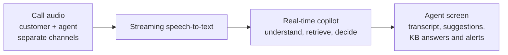
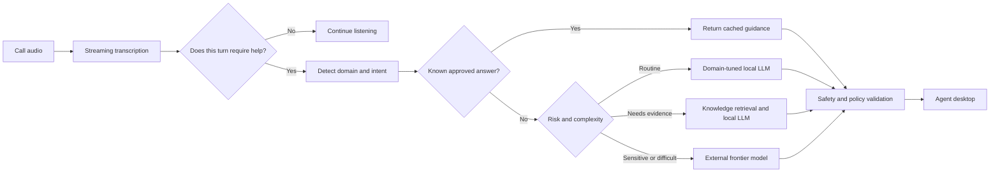
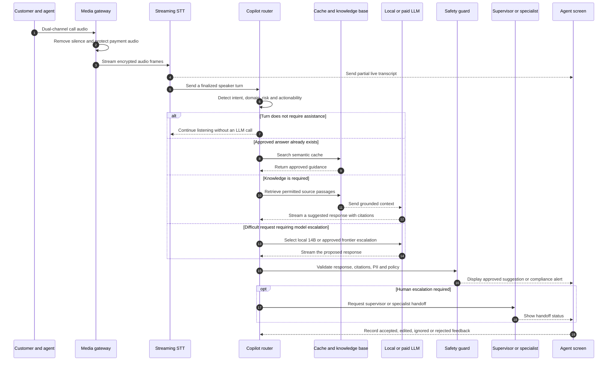
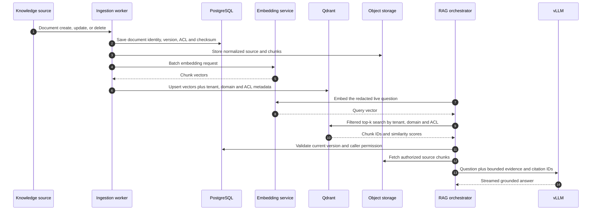

# Agent Voice Pilot

An architecture and proof of concept for an AI assistant that listens to live support calls and gives agents useful, text-based guidance while the conversation is still happening.

## Contents

- [System at a glance](#system-at-a-glance)
- [Product behavior](#what-the-agent-receives)
- [Routing and call execution](#how-an-utterance-becomes-a-suggestion)
- [Models and tenant isolation](#model-selection)
- [Kubernetes deployment](#deployment-blueprint)
- [Scale and capacity](#scale-and-capacity)
- [Economics](#economics)
- [Reliability and security](#reliability-security-and-compliance)
- [Proof of concept](#what-is-implemented-here)
- [Production roadmap](#from-prototype-to-production)

## System at a glance



The system listens to separate customer and agent channels, produces a live transcript, decides whether assistance is needed, and displays guidance without interrupting the conversation.

## The problem

A call-center copilot must respond quickly enough to help during a conversation, understand the company’s domain, protect customer data, and remain affordable across thousands of locations.

Sending complete calls to a general-purpose hosted LLM does not meet those requirements well. It increases network traffic, exposes the system to provider latency and rate limits, and charges premium inference prices for routine questions.

Agent Voice Pilot instead separates the work into specialized stages. Speech recognition, intent detection, retrieval, response generation, and safety checks can then scale independently.

## What the agent receives

The assistant is designed to add information to the agent’s existing desktop rather than speak into the call.

- A live transcript with separate customer and agent turns
- Short suggested responses
- Relevant policy or knowledge-base cards
- Required compliance steps
- Intent, sentiment, and escalation indicators
- Draft notes and a post-call summary

Text is the primary output because it is silent, persistent, scannable, and auditable. It does not compete with the customer’s voice or force the agent to listen to another audio stream.

## How an utterance becomes a suggestion

The LLM is not called for every audio fragment. The system waits for a meaningful customer or agent turn, then makes a sequence of increasingly expensive decisions.



This control loop has four important properties:

1. **No unnecessary generation.** Greetings, acknowledgements, and unfinished turns do not consume LLM capacity.
2. **Repetition becomes an advantage.** Approved answers can be reused for common requests such as refunds, plan changes, or device resets.
3. **Domain knowledge stays isolated.** The selected business domain controls the prompt, adapter, retrieval collection, and compliance policy.
4. **Escalation is deliberate.** A hosted frontier model is a controlled exception for ambiguous, high-risk, or unusually complex cases.

## How one call is executed



The live call continues even if an AI component is unavailable. The system observes a passive copy of the audio, and the agent remains responsible for accepting or rejecting every suggested action.

## Model selection

The architecture is model-agnostic. Each model sits behind a replaceable service boundary and is selected by measured accuracy, latency, license, and operating cost.

| Responsibility | Primary reference choice | Alternative or escalation | Serving location |
|---|---|---|---|
| Voice activity detection | Silero VAD | Equivalent small audio classifier | Site edge or regional CPU |
| Streaming transcription | Parakeet-TDT 0.6B v2 | Whisper large-v3-turbo; paid STT for bursts and long-tail languages | Triton/Riva on regional L4-class GPUs; optional on-site deployment |
| Domain and intent routing | Fine-tuned DeBERTa-v3-small | Rules and embedding similarity for guarded fallback checks | Regional CPU or small GPU |
| Entity and PII detection | GLiNER plus Presidio | Tenant-specific deterministic rules | Regional CPU/small GPU before storage or external calls |
| Sentiment and escalation risk | Fine-tuned DistilRoBERTa | Domain-specific classifier | Regional CPU or small GPU |
| Embeddings | bge-m3 | Re-benchmarked multilingual embedding model | Triton GPU service |
| Reranking | bge-reranker-v2-m3 | Compatible cross-encoder | Triton GPU service |
| Routine live guidance | Llama 3.1 8B Instruct or Qwen2.5-7B with domain LoRA | Local 14B or approved frontier model when complexity, confidence, policy conflict, or local failure requires it | vLLM on regional L40S-class GPUs |
| Complex RAG synthesis | Qwen2.5-14B or equivalent | Frontier reasoning model | Regional vLLM or controlled external API |
| Post-call summary and QA | Quantized Llama 3.3 70B in batches | Frontier Batch API | Off-peak or preemptible batch GPU pool |

Model names are reference candidates, not fixed dependencies. Benchmark accuracy, time-to-first-token, throughput, memory use, languages, safety, and licensing against representative calls every quarter. Prefer permissive licenses where possible, and review every model release before redistribution or production deployment.

### Open versus paid models

| Decision factor | Self-hosted open model | Paid model API |
|---|---|---|
| Best fit | Repetitive, high-volume, latency-sensitive work | Low-volume difficult reasoning and overflow |
| Data control | Full regional control | Contractual controls and zero-retention agreement required |
| Latency | Predictable when served in-region | Network and provider queueing add variance |
| Customization | Full fine-tuning and LoRA support | Provider-dependent |
| Operations | GPU capacity and model lifecycle are internal responsibilities | Provider operates inference |
| Unit economics | Strong when regional GPUs remain highly utilized | Strong for pilots and small or bursty regions |

The practical rule is open-first, not open-only. A new region or small tenant may start with managed APIs, then move steady volume to self-hosting once it can keep a regional fleet utilized.

### Model escalation versus human escalation

Model escalation selects stronger automation: the LLM gateway begins with the routine 8B pool, moves to the local 14B pool for complex synthesis, and may use an approved frontier API for low confidence, retrieval conflict, policy conflict, high risk, or local-model failure. The routing contract carries `model_hint`, `complexity`, `risk_level`, `retrieval_confidence`, `external_api_allowed`, and latency targets; the threshold values come from evaluation data rather than fixed assumptions.

Human escalation is independent. The router or output guard notifies a supervisor or specialist for explicit handoff requests, fraud, legal or compliance requirements, unsafe answers, or exhausted regeneration retries. A turn can use a stronger model and request human assistance at the same time.

### Multi-tenancy and domain packs

One shared base model serves many business domains through hot-swappable LoRA adapters. The router selects a complete domain pack rather than only a model:

```text
domain pack = prompt policy
            + LoRA adapter
            + Qdrant collection
            + compliance rules
            + language configuration
            + escalation thresholds
```

- PostgreSQL stores tenant, site, policy, entitlement, model-release, and document-access metadata.
- Qdrant collections are partitioned and filtered by tenant and domain.
- Object-storage prefixes and encryption keys are tenant-scoped.
- Redis keys include region, tenant, and call identifiers and expire automatically.
- Every request is authorized again at retrieval time; selecting a tenant collection is not sufficient by itself.
- Router confidence thresholds are configuration, not hard-coded behavior. Banking and healthcare domains can escalate earlier than low-risk retail workflows.

## Deployment blueprint

The production reference stack runs one Kubernetes cluster per processing region. Each site connects to its nearest healthy region. Direct streaming APIs carry latency-sensitive traffic; Kafka carries durable events for storage, analytics, and post-call processing.

```mermaid
flowchart LR
    classDef edge fill:#e8f4ff,stroke:#2673b8,color:#111
    classDef api fill:#fff3d6,stroke:#b47b00,color:#111
    classDef cpu fill:#ebf8e8,stroke:#39833a,color:#111
    classDef gpu fill:#f4e8ff,stroke:#7545a3,color:#111
    classDef data fill:#ffe9e9,stroke:#a94442,color:#111
    classDef external fill:#f2f2f2,stroke:#666,color:#111

    subgraph SITE[Call-center site]
        PBX[PBX or CCaaS]:::edge
        TAP[SIPREC and RTP media gateway]:::edge
        PRE[VAD, channel split and payment masking]:::edge
        UI[Agent desktop widget]:::edge
        PBX -->|SIPREC: customer plus agent audio| TAP
        TAP --> PRE
    end

    subgraph K8S[Regional Kubernetes cluster]
        direction LR

        subgraph ENTRY[ingress namespace]
            GW[Envoy Gateway and regional load balancer]:::api
            AUTH[Identity, tenant and rate-limit filter]:::api
            WS[Agent WebSocket gateway]:::api
            GW --> AUTH
        end

        subgraph LIVE[live-call namespace - CPU]
            SESSION[Session orchestrator]:::cpu
            STTG[STT stream gateway]:::cpu
            TURN[Turn finalizer and transcript assembler]:::cpu
            PII[PII redaction service]:::cpu
            ROUTER[Intent, domain, complexity and risk router]:::cpu
            CACHE[Semantic and retrieval cache]:::cpu
            RAG[RAG orchestrator]:::cpu
            LLMGW[LLM gateway]:::cpu
            GUARD[Output policy guard]:::cpu
            ESC[Human escalation and supervisor event]:::cpu
            AUDIT[Audit and telemetry publisher]:::cpu
            SESSION --> STTG
            TURN --> PII
            PII --> ROUTER
            ROUTER -->|requires_rag=false<br/>Generation Request: model_hint, complexity,<br/>risk_level, latency_target, external_allowed| LLMGW
            ROUTER -->|requires_rag=true<br/>cache_allowed=true| CACHE
            CACHE -->|approved answer hit| GUARD
            CACHE -->|retrieval-context hit| LLMGW
            CACHE -->|miss, stale or unsafe| RAG
            ROUTER -->|requires_rag=true<br/>cache_allowed=false| RAG
            RAG -->|grounded generation request<br/>context, citations and retrieval scores| LLMGW
            ROUTER -->|human_required=true<br/>critical risk or explicit supervisor request| ESC
            ESC -->|update call state| SESSION
            ESC -->|supervisor alert and handoff| WS
            ESC -->|escalation event| KAFKA
            LLMGW --> GUARD
            GUARD -->|approved suggestion| WS
            GUARD -->|regenerate within retry budget<br/>retry_count, guard_failure_reason, maximum_attempts| LLMGW
            GUARD -->|retry budget exhausted| ESC
            ROUTER --> AUDIT
            CACHE --> AUDIT
            RAG --> AUDIT
            LLMGW --> AUDIT
            GUARD --> AUDIT
        end

        subgraph GPU[gpu-inference namespace]
            STT[STT model server<br/>Triton plus Parakeet or Whisper]:::gpu
            NLP[Classifier and embedding server<br/>Triton]:::gpu
            LOCAL8[Routine LLM pool<br/>vLLM plus 8B models and LoRA]:::gpu
            LOCAL14[Complex LLM pool<br/>vLLM plus 14B models and LoRA]:::gpu
            BATCH[Post-call model workers<br/>large model on batch GPU pool]:::gpu
        end

        subgraph STATE[data namespace]
            REDIS[(Redis Cluster<br/>active sessions, locks and cache)]:::data
            PG[(PostgreSQL<br/>tenants, policies, calls and audit index)]:::data
            QD[(Qdrant<br/>tenant and domain vector collections)]:::data
            OBJ[(S3-compatible object storage<br/>documents, models and approved artifacts)]:::data
            KAFKA[(Kafka event bus)]:::data
        end

        subgraph ASYNC[worker namespace]
            WRITER[Transcript and audit writer]:::cpu
            POST[Post-call job coordinator]:::cpu
            INDEX[Knowledge ingestion workers]:::cpu
            ANALYTICS[Analytics event sink]:::cpu
        end

        STTG <-->|bidirectional gRPC<br/>audio chunks and transcript hypotheses| STT
        STTG -->|partial and final transcript| TURN
        ROUTER <-->|intent, domain, sentiment and risk classification| NLP
        CACHE <-->|approved answers and retrieval cache| REDIS
        RAG <-->|embedding and reranking requests| NLP
        RAG <-->|vector search| QD
        RAG -->|document metadata and access policy| PG
        RAG -->|source content| OBJ
        LLMGW <-->|routine inference: 8B| LOCAL8
        LLMGW <-->|complex RAG synthesis: 14B| LOCAL14
        SESSION <-->|ephemeral call state| REDIS
        SESSION -->|call and transcript events| KAFKA
        PII -->|redacted transcript events| KAFKA
        AUDIT -->|routing, retrieval, generation and policy events| KAFKA
        KAFKA --> WRITER
        KAFKA --> POST
        KAFKA --> ANALYTICS
        WRITER --> PG
        WRITER --> OBJ
        POST --> BATCH
        BATCH --> OBJ
        INDEX -->|upsert vectors| QD
        INDEX -->|metadata and document versions| PG
        INDEX -->|source artifacts| OBJ
        INDEX -->|invalidate affected tenant and document cache| REDIS
        INDEX -->|ingestion and version events| KAFKA
    end

    subgraph EXT[External and central services]
        IDP[OIDC identity provider]:::external
        CRM[CRM and ticketing APIs]:::external
        KB[Knowledge sources<br/>SharePoint, files and product systems]:::external
        PAID[Approved paid LLM API]:::external
        CONTROL[Central control plane<br/>GitOps, model registry and evaluation]:::external
    end

    PRE -->|TLS WebSocket or gRPC audio| GW
    AUTH -->|audio session| SESSION
    AUTH -->|agent WebSocket upgrade| WS
    IDP -->|OIDC and JWKS| AUTH
    WS -->|WebSocket transcript and guidance| UI
    LLMGW <-->|redacted approved escalation<br/>complexity, low confidence, policy risk or local failure| PAID
    POST -->|summary and disposition update| CRM
    KB -->|connector or webhook| INDEX
    CONTROL -->|GitOps config and signed model releases| K8S
```



### Selected infrastructure services

| Layer | Reference service | Responsibility |
|---|---|---|
| Container platform | Kubernetes with separate CPU, real-time GPU, and batch GPU node pools | Scheduling, isolation, health checks, rolling deployment, and autoscaling |
| North-south traffic | Envoy Gateway behind a managed regional load balancer | TLS termination, WebSocket/gRPC routing, request limits, and regional failover |
| Service identity | OIDC for users; workload identity and mTLS for services | Tenant authentication without distributing long-lived credentials |
| Live APIs | gRPC bidirectional streams internally; WebSocket to the agent UI | Low-latency audio, partial transcripts, token streams, and agent updates |
| Event backbone | Kafka with replicated regional brokers | Durable call events, redacted transcript events, audit events, and background jobs |
| Session state | Redis Cluster | Active-call context, short locks, rate counters, and semantic-response cache |
| Relational data | PostgreSQL with regional read replicas and automated backups | Tenants, users, policies, call metadata, model decisions, feedback, and audit indexes |
| Vector data | Qdrant collections partitioned by tenant and domain | Embeddings for RAG and semantic similarity search |
| Blob data | S3-compatible object storage | Source documents, approved answers, model artifacts, and policy-controlled transcripts |
| Speech and NLP serving | NVIDIA Triton Inference Server | Streaming STT, domain classifier, embedding, and reranker models |
| LLM serving | vLLM with an OpenAI-compatible API | Token streaming, continuous batching, quantized models, and domain LoRA adapters |
| Deployment | Argo CD or Flux plus Helm | Reproducible GitOps deployment across regions |
| Observability | OpenTelemetry, Prometheus, Grafana, and a log backend | Traces, metrics, logs, GPU utilization, latency, and per-tenant usage |

Managed equivalents can replace the stateful components: Amazon EKS/MSK/RDS/S3, Azure AKS/Event Hubs/PostgreSQL/Blob Storage, or Google GKE/Managed Kafka/Cloud SQL/Cloud Storage. The application contracts remain the same.

### Live call path

The live path uses direct streaming calls because putting audio frames or generated tokens through a durable queue would add latency and make backpressure harder to control.

1. The PBX or contact-center platform creates a passive SIPREC copy of the customer and agent channels. The AI system is not inserted into the phone path.
2. The site media gateway converts RTP into framed audio, preserves the speaker channel, applies voice activity detection, and stops or masks capture during protected payment entry.
3. The gateway opens a TLS WebSocket or bidirectional gRPC session through Envoy. The identity filter validates the tenant, site, call, and allowed residency region.
4. The session orchestrator assigns a regional session, stores short-lived state in Redis, and connects the stream to the STT gateway.
5. The STT gateway batches audio across calls and streams it to a Triton-hosted speech model. Partial transcripts can be displayed immediately; only finalized turns continue to LLM routing.
6. The transcript assembler joins speaker-labelled turns. The redaction service removes PII before the text is stored, published to Kafka, used for RAG, or sent outside the cluster.
7. The router calls the classifier model to produce one structured route decision: intent, domain, complexity, risk level, model hint, tenant policy, and whether RAG, cache reuse, or human escalation is required. Non-actionable turns end here; critical-risk or supervisor-requested turns create an escalation event, update call state, and notify the agent desktop.
8. Cacheable domain queries go to the semantic and retrieval cache. It accepts an answer only when its tenant, policy version, language, expiry, risk level, customer-data scope, and citations remain valid. An approved answer goes directly to the output guard, a retrieval-context hit goes to the LLM gateway, and a miss, stale entry, or unsafe result goes to RAG. Queries that cannot be cached bypass this step.
9. The RAG service embeds the question, searches the tenant’s Qdrant collection, checks document permissions in PostgreSQL, and loads authorized source fragments from object storage. It passes the grounded context, citations, and retrieval scores to the LLM gateway.
10. The LLM gateway selects the routine 8B or complex 14B local pool from the generation contract. It evaluates confidence, citation coverage, policy conflict, and local failure after generation; only approved escalation cases are redacted and sent to the frontier API, whose response returns through the gateway before policy validation.
11. The output guard validates citations, prohibited language, PII, and required compliance phrasing. Approved suggestions stream to the correct agent desktop; blocked results return to the gateway only within a bounded retry budget carrying `retry_count`, `guard_failure_reason`, and `maximum_attempts`. Exhausting that budget escalates the turn to a human.
12. The audit and telemetry publisher emits routing, cache, retrieval, generation, and policy events to Kafka alongside the response, without blocking the live suggestion.

### Where queues and events are used

Kafka is the boundary between the real-time product and work that may be retried or processed later. Events use a schema registry, include `tenant_id`, `region`, `call_id`, `event_id`, `occurred_at`, and `schema_version`, and contain redacted data only.

| Topic | Producer | Consumers | Purpose |
|---|---|---|---|
| `call.lifecycle.v1` | Session orchestrator | Audit writer, analytics | Call started, connected, ended, or failed |
| `transcript.final.v1` | PII redaction service | Transcript writer, analytics, post-call coordinator | Final speaker-labelled and redacted turns |
| `copilot.decision.v1` | Audit and telemetry publisher | Audit writer, evaluation pipeline | Route, confidence, model choice, cache decision, and policy version |
| `copilot.suggestion.v1` | Audit and telemetry publisher | Audit writer, feedback service | Validated suggestion, sources, latency, and model version |
| `copilot.escalation.v1` | Human escalation service | Audit writer, agent UI service | Supervisor handoff, status, and retry-budget exhaustion |
| `agent.feedback.v1` | Agent UI service | Evaluation and router-training pipeline | Accepted, edited, ignored, or rejected suggestion |
| `postcall.request.v1` | Post-call coordinator | Batch model workers | Summary, disposition, and QA work after call completion |
| `knowledge.changed.v1` | Knowledge connectors | Chunking and indexing workers | Re-index a created, updated, or deleted source document |
| `knowledge.ingested.v1` | Knowledge ingestion workers | Cache invalidation, audit writer, analytics | Completed document version and ingestion status |
| `deadletter.*` | Kafka consumers | Operations tooling | Events that repeatedly fail validation or processing |

Each consumer stores its own idempotency key in PostgreSQL or Redis. Kafka delivery is treated as at-least-once, so consumers must safely ignore duplicate `event_id` values. Raw audio is not placed on Kafka.

### RAG ingestion and query flow

RAG has a write path and a read path; mixing them in one service makes access control and re-indexing difficult.



PostgreSQL is the source of truth for document identity, version, ownership, access policy, and deletion state. Qdrant stores searchable vectors and filter metadata, not the authoritative document record. Object storage holds the normalized content. Each completed ingestion emits a version event and invalidates affected tenant and document cache entries in Redis. Deleting a document first marks it unavailable in PostgreSQL, then an idempotent event removes its vectors, blobs, and cache entries.

### API and protocol boundaries

| From | To | Protocol | Example operation |
|---|---|---|---|
| Site media gateway | Regional ingress | TLS WebSocket or bidirectional gRPC | `StreamCallAudio` |
| Agent desktop | WebSocket gateway | WebSocket with OIDC access token | Subscribe to transcript and suggestion events for one call |
| Session orchestrator | STT gateway | Bidirectional gRPC | Audio frames in; partial/final transcript frames out |
| Router | Triton NLP server | gRPC | Domain, intent, risk, embedding, and reranking inference |
| RAG service | Qdrant | gRPC | Filtered vector search and batch upsert |
| Application services | PostgreSQL | PostgreSQL wire protocol through a connection pooler | Transactional metadata and audit indexes |
| Application services | Redis | TLS RESP | Session state, cache, locks, and counters |
| LLM gateway | vLLM | Internal OpenAI-compatible HTTP streaming API | `/v1/chat/completions` |
| LLM gateway | Paid provider | Provider HTTPS API through controlled egress | Redacted escalation request |
| Services and workers | Kafka | TLS SASL Kafka protocol | Publish and consume versioned events |
| Post-call worker | CRM | REST or vendor SDK | Write summary, disposition, and agent-approved notes |

### Kubernetes workload layout

- **CPU node pool:** gateways, session orchestration, routing, redaction, RAG orchestration, Kafka consumers, and API services.
- **Real-time GPU node pool:** STT, embeddings, reranking, and 8B/14B vLLM pods. Use taints, tolerations, topology spread, and priority classes so batch jobs cannot evict live inference.
- **Batch GPU node pool:** post-call models, evaluation, and fine-tuning. This pool may use preemptible capacity because all work is checkpointable and queue-backed.
- **Stateful services:** use managed PostgreSQL, Kafka, Redis, and object storage where available. If Qdrant runs in-cluster, use dedicated stateful nodes, persistent volumes, anti-affinity, snapshots, and restore testing.
- **Autoscaling:** HPA/KEDA scales stateless services from request rate, Kafka lag, and active sessions. GPU model replicas scale from queue depth, tokens per second, and time-to-first-token rather than CPU usage.
- **Isolation:** namespaces, network policies, workload identity, secrets from a managed vault, per-tenant authorization, and separate regional encryption keys restrict the blast radius.
- **Release safety:** signed images, admission policies, canary model deployments, automatic rollback, and shadow evaluation prevent an untested model from replacing the live fleet globally.

### Data ownership and retention

| Data | System of record | Typical retention rule |
|---|---|---|
| Tenant, site, user, policy, and model configuration | PostgreSQL | Tenant lifetime plus audit requirement |
| Active transcript window and session state | Redis | Minutes to hours; expires automatically |
| Final redacted transcript and call metadata | PostgreSQL plus object storage | Policy-driven; for example 30–90 days |
| Raw audio | Regional object storage only when explicitly required | Disabled by default or shortest permitted period |
| Knowledge documents | Object storage; metadata and ACL in PostgreSQL | Until source deletion or replacement |
| Embeddings | Qdrant | Same lifecycle as the corresponding document version |
| Model artifacts and LoRA adapters | Versioned object storage and model registry | Retain every deployed or audited version |
| Audit and model-decision events | Kafka during transport; durable analytics/audit store afterward | Compliance-driven and immutable |

No external model receives raw audio. External requests contain only the minimum redacted text and retrieved evidence allowed by tenant policy.

### In each processing region

Regional services perform the latency-sensitive work: transcription, classification, retrieval, LLM inference, and WebSocket delivery to the agent screen. Pooling GPUs across many sites provides better utilization than installing an inference server in every call center.

### In the central platform

The central layer manages tenants, model versions, evaluation, audit policy, and asynchronous analytics. It does not need raw audio from every location. External-model access passes through one gateway so retention rules, redaction, budgets, and provider failures can be managed consistently.

## Scale and capacity

This section is a capacity model, not a measured production result. The original requirement can be read in two very different ways: **5,000 physical call centers** or **5,000 agents in total**. The large reference case below deliberately uses the first interpretation as a stress test. A normal pilot should use the smaller seat-based model that follows it.

### Large-network stress test: 5,000 sites

| Planning input | Reference value | How it is derived |
|---|---:|---|
| Physical locations | 5,000 call centers | Requirement assumption, not a measured count |
| Planning calendar | 231 open days/year | `365 - (52 weeks × 2 weekly days off) - 30 additional holiday/closure days` |
| Open hours | 15 hours/site/day | Midpoint of a 14–16-hour operating window, normally covered by staggered shifts |
| Average active calls while open | 7.5/site in the base case | 15% of the 50-call peak; also evaluate 5 and 10 average calls/site |
| Local peak capacity | 50 simultaneous calls/site | A site-level ceiling, not an assumption that all sites peak together |
| Base global peak | 62,500 simultaneous calls | `5,000 × 50 × 25% peak coincidence`; validate across time zones from ACD data |
| Stress-test global peak | 250,000 simultaneous calls | 100% coincidence: every site reaches its local peak at the same moment |
| Average connected-call duration | 6 minutes | Audio connection time, including on-call hold; after-call work is excluded |
| Annual call-minutes | Approximately 7.8 billion in the base case | `5,000 × 231 × 15 × 60 × 7.5`; equivalent to about 1.30B six-minute calls |
| Year-round average concurrency | Approximately 14,800 calls | `7.8B minutes ÷ 525,600 minutes/year` |
| Base global peak-to-average ratio | Approximately 4.2× | `62,500 base peak ÷ 14,800 year-round average`; the stress ceiling is about 16.9× |
| Raw STT input | Approximately 15.6 billion channel-minutes/year | Two independently transcribed channels per call |
| Combined speech time | 4.5 minutes/call | Customer plus agent speech occupies an assumed 75% of the six-minute connection; measure cross-talk and hold time |
| Speech-bearing STT inference | Approximately 5.85 billion channel-minutes/year | `7.8B call-minutes × 75% combined speech`; silence on the two channels is not counted twice |
| English transcript size | Approximately 585 words or 760 tokens/call | `4.5 speech-minutes × 130 words/minute × 1.3 tokens/word` |
| Real-time LLM requests | Approximately 6.24B/year in the base case | `7.8B call-minutes × 4 finalized utterances/minute × 20% generation rate` |
| Processing regions | 12–20 | Base average of about 3,100–5,200 peak calls/region; stress ceiling of 12,500–20,800 before skew |

The 7.8B-minute figure is a middle scenario, not a target that the design must reach. Average utilization is the most uncertain input:

| Utilization scenario | Average active calls/site | Share of 50-call site peak | Annual call-minutes | Six-minute calls/year |
|---|---:|---:|---:|---:|
| Low | 5 | 10% | Approximately 5.20B | Approximately 866M |
| **Base** | **7.5** | **15%** | **Approximately 7.80B** | **Approximately 1.30B** |
| High | 10 | 20% | Approximately 10.40B | Approximately 1.73B |

If real ACD data shows only two or three average simultaneous calls per site, the annual workload should be reduced accordingly. Steady compute and API consumption should follow measured average traffic. Do not procure for the 250,000-call ceiling unless traffic data shows that site peaks really coincide or the business explicitly requires that disaster-capacity guarantee.

The distinction between raw and speech-bearing audio matters. Two six-minute channels create 12 channel-minutes of transport, but normally the customer and agent take turns speaking. Assuming 60% speech on **each** channel would incorrectly imply 7.2 minutes of speech inside a six-minute call. This model instead assumes 4.5 combined speech-minutes and requires the real ratio to be measured from audio samples.

A managed STT provider may bill the six-minute media duration once for a stereo/multi-channel request, twice for two independent streams, or according to another product-specific rule. Voice activity detection lowers the provider bill only when silence can be removed before its billing boundary. The pricing model must therefore show both the provider's channel policy and the architecture's stream format.

### What one six-minute call produces

| Item | Baseline per call | Planning note |
|---|---:|---|
| Connected audio | 6 call-minutes | Use ACD connected duration, not handle time with after-call work |
| Raw dual-channel transport | 12 channel-minutes | Customer and agent channels stay separate |
| Speech sent to self-hosted STT inference | Approximately 4.5 channel-minutes | 75% combined speech occupancy after voice activity detection |
| Transcript | Approximately 585 words / 760 tokens | English at 130 words/minute and 1.3 tokens/word; measure each language separately |
| Plain transcript storage | Approximately 4–8 KB | Before timestamps, confidence, speaker labels, JSON, indexes, replicas, and audit metadata |
| Finalized conversational turns | Approximately 24 | `6 minutes × 4 utterances/minute`; used by the lightweight router |
| Live LLM generations | Approximately 4.8 | `24 utterances × 20%`; use 10%–40% as a sensitivity range |
| Average live-LLM input | 1,200 tokens/generation | Includes system policy, compact call state, user turn, and optional retrieved evidence |
| Average live-LLM output | 100 tokens/generation | Capacity envelope for a short agent suggestion; measure the real output distribution |
| Total live-LLM tokens | Approximately 5,760 input plus 480 output | `4.8 generations × 1,200 input + 100 output`; repeated prefixes still consume serving capacity |
| Post-call job | Approximately 1,200 input plus 400 output tokens | Transcript/state in; summary, disposition, and quality fields out |

These token values are deliberately explicit assumptions. Capture actual tokenizer counts at the LLM gateway and report p50, p90, and p99 by language, domain, cache status, and RAG usage. Averages alone are insufficient for latency and memory planning.

Call duration changes the number of calls even when annual call-minutes stay fixed. With four utterances per call-minute and a 20% generation rate, LLM request rate follows active call-minutes rather than calls completed:

| Average call duration | Calls from 7.8B call-minutes | Peak completed calls/s at 62,500 base concurrency | Base LLM requests/s |
|---:|---:|---:|---:|
| 4 minutes | Approximately 1.95B/year | Approximately 260 | Approximately 833 |
| **6 minutes (baseline)** | **Approximately 1.30B/year** | **Approximately 174** | **Approximately 833** |
| 10 minutes | Approximately 780M/year | Approximately 104 | Approximately 833 |

Multiply the peak-rate columns by four for the 250,000-call stress ceiling.

Longer calls also contain more text. Measure utterances and generation routing per call-minute rather than holding a fixed number of generations per call.

The calendar needs one important interpretation. `52 weeks × 2 days off = 104 days`, but those may be **agent roster days off**, not days when the call center closes. Likewise, a one-month holiday period contains roughly eight weekend days; if it already includes weekends, subtract about 22 additional weekdays rather than another 30 days. That produces 239 open days instead of the conservative 231-day baseline.

At the base utilization of 7.5 active calls/site, 231 open days produce approximately 7.28B, 7.80B, and 8.32B call-minutes for 14-, 15-, and 16-hour operating days. A 15-hour site does not require a 15-hour agent shift: use overlapping eight-hour shifts and calculate staffing separately. Centers that remain open on weekends or national holidays must use their actual site calendar.

### More typical rollout example: 5,000 agents total

For comparison, assume 5,000 named full-time agents. Start with 365 calendar days, subtract 104 weekly days off and a combined 30 additional days for public holidays, annual leave, sickness, training, and other shrinkage. That leaves an illustrative 231 productive days per agent. Assume an eight-hour agent shift and 70% connected-call occupancy; breaks and after-call work are outside connected audio. Do not give an individual agent a 14–16-hour shift merely because the site is open that long.

| Planning input | Example value | How it is derived |
|---|---:|---|
| Productive days per agent | 231/year | `365 - 104 weekly days off - 30 combined holiday/leave/shrinkage days` |
| Annual call-minutes | Approximately 388.1 million | `5,000 × 231 × 8 × 60 × 70%` |
| Six-minute calls | Approximately 64.7 million/year | `388.1M ÷ 6` |
| Peak simultaneous calls | Measure; provision an example 4,000 | 3,500 active calls plus about 15% operational headroom |
| Raw dual-channel STT transport | Approximately 776.2 million channel-minutes/year | `388.1M × 2 channels` |
| Speech-bearing STT inference | Approximately 291.1 million channel-minutes/year | `388.1M × 75% combined speech` |
| Transcript text | Approximately 49.2 billion English tokens/year | `64.7M calls × 760 transcript tokens` |
| Real-time LLM requests | Approximately 310M/year | `388.1M call-minutes × 4 utterances/minute × 20%` |
| Live-LLM token volume | Approximately 373B input and 31B output | Requests multiplied by 1,200 input and 100 output tokens |

This seat-based example is about **20× smaller by annual call-minutes** and about **62× smaller by provisioned peak concurrency** than the 5,000-site base case. Costs do not fall perfectly in proportion because every active region still needs a minimum highly available service footprint. Holiday, leave, and sickness allowances affect named-agent capacity; they should not be subtracted again if the input already contains actual logged-in hours.

### Peak fleet planning

Fleet size must come from a benchmark of the exact model, language mix, audio chunking, prompt length, output limit, quantization, and latency objective. The planning baseline below uses 25% peak coincidence, or 62,500 simultaneous calls globally, plus 30% failover/headroom. It is not a hardware quote.

| Component | Explicit planning assumption | Illustrative peak requirement |
|---|---|---:|
| Streaming STT GPU inference | 46,875 speech-bearing channel equivalents at base peak; benchmark 150–300 real-time channel equivalents per GPU | Approximately 203–406 GPUs |
| STT session and media handling | 125,000 open channel streams at base peak; silence still consumes connections and CPU | Size CPU nodes from connection, codec, and network tests |
| Fast NLP/router | Approximately 3,500–6,900 finalized turns/s and 2,000 turns/s per 16-core node | Approximately 2–5 compute nodes mathematically; deploy at least 24–40 for two nodes in each of 12–20 regions |
| Live 8B LLM decode | Approximately 833 requests/s at base peak and 100 output tokens/request; benchmark 1,500 useful output tokens/s/GPU at the latency target | At least 73 decode GPUs after 30% headroom |
| Embedding and reranking | Depends on the percentage of turns that miss cache and require RAG | Benchmark first; a two-GPU regional floor is 24–40 GPUs across 12–20 regions |
| Post-call large-model work | Annual average is about 41 completed calls/s; base instantaneous peak is about 174 calls/s and the stress ceiling is about 694 calls/s | Queue the work and size to its completion SLA, not live-call peak |

The GPU formulas are:

```text
STT GPUs
  = global peak calls × combined speech share × headroom
    ÷ benchmarked real-time speech streams per GPU

decode GPUs
  = requests/second × output tokens/request
    ÷ benchmarked useful output tokens/second/GPU

prefill GPUs
  = requests/second × uncached input tokens/request
    ÷ benchmarked useful input tokens/second/GPU

final live-LLM fleet
  = ceiling(max(decode, prefill, latency/concurrency, KV-memory, regional floor)
    × headroom)
```

Concurrency alone is not a sufficient sizing unit because it hides prompt length, output length, batching, time to first token, and inter-token latency. Token throughput makes the workload explicit, but the benchmark must report **useful throughput while meeting the p95 latency target**, not the highest offline batch throughput.

#### Worked LLM capacity example

```text
50,000 concurrent calls
× 4 finalized utterances/call-minute
× 20% requiring generation
÷ 60 seconds
= approximately 667 LLM requests/second

667 requests/second × 100 output tokens
= approximately 66,700 output tokens/second

66,700 ÷ 1,500 useful output tokens/second/GPU
= approximately 45 GPUs before headroom

45 × 1.30
= approximately 59 GPUs
```

For this project's 62,500-call base peak, the same calculation is `62,500 × 4 × 20% ÷ 60 ≈ 833 requests/s`, then `833 × 100 ÷ 1,500 × 1.3 ≈ 73 decode GPUs`.

Decode is only one constraint. At 1,200 input tokens/request, the same base traffic creates approximately **1 million input tokens/second** before cached-prefix discounts. Benchmark prefill throughput separately, check KV-cache memory at the required concurrency, and use the largest resulting fleet. Regional minimums and traffic imbalance can increase the deployable count further.

| Coincidence of site peaks | Global peak calls | STT GPUs at 150–300 streams/GPU | Decode GPUs at 100 output tokens/request |
|---:|---:|---:|---:|
| 10% | 25,000 | Approximately 81–163 | Approximately 29 |
| **25% planning base** | **62,500** | **Approximately 203–406** | **Approximately 73** |
| 50% | 125,000 | Approximately 406–813 | Approximately 145 |
| 100% stress ceiling | 250,000 | Approximately 813–1,625 | Approximately 289 |

The counts scale almost linearly with the coincidence factor. They should be replaced by the maximum concurrent calls observed across all regions, not the sum of every site's independent local maximum.

Before procurement, replay at least one week of anonymized traffic through the chosen models and record sustained throughput, p95 latency, GPU memory, failure rate, and output quality. NVIDIA's [Triton Performance Analyzer](https://docs.nvidia.com/deeplearning/triton-inference-server/user-guide/docs/perf_analyzer/docs/README.html) or an equivalent load generator can measure the latency/throughput curve; spreadsheet estimates cannot replace that test.

### Latency and availability targets

| User-visible operation | Target |
|---|---:|
| Partial transcript update | p95 ≤400 ms from audio arrival |
| Finalized agent suggestion | p95 ≤1.5 s from finalized turn |
| Transcript availability | 99.9% |
| Suggestion availability | 99.5% |

The transcript has a higher priority than generation. Under saturation, the platform first reduces low-value suggestions, then restricts RAG or external escalation, while preserving the call and transcription whenever possible.

### Performance and cost optimizations

Beyond the architectural cost controls listed under [Economics](#economics), the serving layer applies several inference-level optimizations. Each keeps the same service boundaries and is validated against the latency and availability targets above.

| Optimization | Where | Effect |
|---|---|---|
| **Prefix caching (KV reuse)** | vLLM live copilot | The domain prompt, policy, and running conversation state form a shared prefix across turns in one call. Reusing the cached KV blocks avoids re-prefilling on every turn and lowers time-to-first-token. |
| **Speculative decoding** | vLLM live copilot | A small draft model proposes tokens that the target model verifies in parallel, improving throughput and TTFT for the p95 ≤1.5 s suggestion target without changing output quality. |
| **FP8/INT8 quantization tiers** | Live 8B/14B on L40S-class GPUs | Serve routine live guidance quantized to raise GPU density and reduce the fast-inference fleet; reserve higher precision for escalation and post-call synthesis. |
| **Micro-batched embeddings** | bge-m3 embedding service | Live RAG queries are grouped in a short time window before hitting the embedding server, mirroring the cross-call batching already used for STT. |
| **Async RAG prefetch** | RAG orchestrator | Embedding and vector search begin while the router is still scoring risk, hiding retrieval latency behind classification. |
| **Near-miss cache reuse** | Semantic cache in Redis | High-similarity cache hits return an approved answer directly or with a small local rewrite instead of a full generation, widening the cache-hit band for recurring requests. |
| **Per-turn token budget caps** | LLM gateway | Suggestions are short by design, so a hard `max_tokens` per turn prevents runaway generation cost. |
| **Request hedging for critical turns** | LLM gateway | High-risk turns can be sent to the local model and the paid provider together, taking the first valid response to trim tail latency where policy allows. |
| **Adaptive escalation threshold** | Router | Paid-model routing thresholds auto-tune from measured local-model safety and accuracy per domain, shrinking the paid share as small models improve. |
| **Feedback-driven router distillation** | `agent.feedback.v1` loop | Accepted/edited/rejected outcomes periodically retrain the router, reducing wrong escalations and unnecessary paid spend. |

The highest-ROI, lowest-risk changes are prefix caching, speculative decoding, and FP8 quantization; all live in the existing vLLM serving layer and improve latency and cost together.

## Economics

At this scale, a credible budget starts with billable units rather than one large total. Provider discounts, languages, data residency, retention, and support terms can move the result by hundreds of millions of dollars.

### Managed-API calculation

| Cost driver | Annual billable volume in the stress test | Calculation |
|---|---:|---|
| Streaming STT | 5.85B speech-bearing channel-minutes after VAD; 7.8B media-minutes if stereo duration is billed once; as much as 15.6B if two full streams are billed | `provider-billable minutes × contracted STT price/minute` |
| Live-LLM input | Approximately 7.48T tokens/year | `6.24B requests × 1,200 input tokens`; split cached and uncached tokens |
| Live-LLM output | Approximately 624B tokens/year | `6.24B requests × 100 output tokens` |
| Post-call LLM | Approximately 1.56T input and 520B output tokens/year | `1.30B calls × 1,200 input + 400 output tokens`; batch discounts may apply |
| Platform services | Media gateways, databases, network, observability, support, and operations | Add separately; these costs remain even when inference is managed |

As a public-price sanity check, Google Cloud currently lists Speech-to-Text V2 standard recognition by processed audio minute, with volume tiers on its [pricing page](https://cloud.google.com/speech-to-text/pricing). Model APIs such as OpenAI publish separate input, cached-input, and output token rates on their [API pricing page](https://openai.com/api/pricing/). These public pages are examples, not vendor selections or enterprise quotes.

An understandable managed estimate therefore looks like this:

```text
annual managed cost
  = provider-billable STT minutes × quoted STT rate
  + LLM requests × average tokens per request × quoted token rates
  + platform, network, storage, support, and operations
```

Do not retain the previous **$330M–$475M** range unless vendor quotes and measured token traces reproduce it. That range was built around the earlier forced 9.5B-minute workload. The new 5.2B–10.4B utilization scenarios must be priced independently rather than scaled from that unsupported total.

### Worked cost for one six-minute call

The following example shows the method, not a purchasing recommendation. It uses an illustrative high-volume STT rate of **$0.004 per billable audio minute**, an LLM input rate of **$1 per million tokens**, and an output rate of **$6 per million tokens**. Those example rates are compatible with publicly listed low-cost tiers as of 2026-07-16, but availability, quotas, model quality, and enterprise terms must be checked.

| Per-call item | Calculation | Example cost |
|---|---:|---:|
| STT when six-minute stereo duration is billed once | `6 × $0.004` | $0.0240 |
| STT when two full six-minute streams are billed | `12 × $0.004` | $0.0480 |
| 10% generation rate | `2.4 generations: 2,880 input + 240 output tokens` | $0.0043 |
| **20% base generation rate** | `4.8 generations: 5,760 input + 480 output tokens` | **$0.0086** |
| 40% generation rate | `9.6 generations: 11,520 input + 960 output tokens` | $0.0173 |
| One post-call job | `1,200 input × $1/M + 400 output × $6/M` | $0.0036 |

This produces the following inference-only boundary:

| Provider billing method | Cost per six-minute call | Cost per connected call-minute | Annual cost at 1.30B base-case calls |
|---|---:|---:|---:|
| STT duration billed once + 10%–40% generated utterances + post-call job | Approximately $0.032–$0.045 | Approximately $0.0053–$0.0075 | Approximately $41M–$58M |
| Two STT streams billed separately + 10%–40% generated utterances + post-call job | Approximately $0.056–$0.069 | Approximately $0.0093–$0.0115 | Approximately $73M–$90M |

At the 20% base generation rate, the corresponding midpoints are approximately **$0.036 per call / $47M per year** when STT duration is billed once and **$0.060 per call / $78M per year** when two streams are billed separately.

These totals exclude media gateways, databases, networking, storage, observability, support, taxes, and operations. They also assume all input tokens receive the same rate. In production, split cached and uncached prompt tokens, paid escalation models, and batch post-call work into separate rows. For a different call duration, replace 6 or 12 STT minutes and derive transcript size from measured speech time; do not scale LLM calls blindly unless actionable-turn frequency also scales with duration.

### Fully loaded hybrid estimate

The following figures remain order-of-magnitude placeholders for the large-network stress test. They are useful for identifying cost categories, but each infrastructure row needs a stated purchase model: owned hardware amortization, reserved cloud capacity, or on-demand cloud pricing.

| Cost category | Planning range per year | What must be validated |
|---|---:|---|
| STT GPU fleet | $1.5M–$4M | 203–406 base GPUs at an illustrative all-in $0.84–$1.12/GPU-hour; benchmark and quote the accelerator plus host VM |
| Live copilot LLM GPU fleet | $1.2M–$3.5M | 73 decode-GPU floor; upper placeholder allows roughly 2× for prefill, KV memory, regional imbalance, and redundancy pending benchmarks |
| RAG embedding and reranking GPUs | $0.3M–$1M | Cache-miss/RAG rate, regional minimum, embedding batch size, and reranker latency |
| Post-call large-model batch compute | $2M–$6M | 1.30B base-case jobs, batch model, tokens/job, completion SLA, and interruptible pricing |
| CPU media, routing, API, and WebSocket services | $4M–$8M | 500,000 open channel streams, codec cost, regional redundancy, and connection tests |
| PostgreSQL, Qdrant, Redis, Kafka, and retained artifacts | $2M–$5M | Events/call, vector count, retention, replicas, backup, and storage tier |
| Regional and inter-region network traffic | $3M–$8M | Audio bitrate, egress direction, cross-zone replication, and carrier/private-link fees |
| Paid STT/LLM overflow and difficult cases | $6M–$20M | Escalation percentage multiplied by the managed-unit formulas above |
| Regulated-site edge equipment | $3M–$8M | Number of regulated sites, redundancy, depreciation period, support, and spares |
| Observability and control-plane services | $2M–$5M | Metric/log/cardinality volume, retention, traces, and vendor or self-hosted operation |
| Operations and SRE team | $3M–$8M | Loaded compensation by country, on-call coverage, security, data, and ML operations |
| Fine-tuning and evaluation | $1M–$4M | Dataset labeling, judge/evaluation runs, training cadence, and specialist staff |
| **Subtotal of the rows above** | **$29M–$80.5M** | Arithmetic total before contingency; the width reflects unquoted inputs |
| **Planning total with 20% contingency** | **$34.8M–$96.6M** | Approximately **$0.0045–$0.0124 per call-minute** at 7.8B base-case minutes |

The GPU hourly rates are transparent placeholders derived from the annual row totals, not negotiated quotes. Cloud bills also include the host VM, CPU, memory, disks, network, reservations, and regional pricing. Google Cloud's [Compute Engine pricing documentation](https://cloud.google.com/products/compute/pricing) confirms that these resources and commitment discounts are priced separately. For procurement, replace the placeholder hourly rates with dated quotes for every processing region.

The prior **$57M–$86M** total did not reconcile with its own line items or expose enough inputs. The revised range uses the 25% peak-coincidence baseline and keeps the 100% case as a stress ceiling. It is mathematically consistent, but it is still not a quote. If categories overlap, remove the overlap from the affected rows instead of instructing readers not to add them.

The hybrid estimate includes more than GPUs: compute, network traffic, regional data services, external-model usage, regulated-site equipment, observability, evaluation, and the team required to operate the platform. It excludes agent salaries, contact-center software licenses, telephony charges, taxes, financing, and the cost of replacing existing desktop integrations unless those are added explicitly.

The most valuable cost controls are architectural:

- Remove silence before speech recognition.
- Generate only after an actionable turn.
- Reuse reviewed answers for recurring interactions.
- Keep prompts short by maintaining a running conversation state.
- Share base models across domains through lightweight adapters.
- Move summaries and quality scoring to batch capacity.
- Autoscale regional pools around predictable call volume.
- Route only a measured minority of requests to paid models.

All numbers are planning estimates in US dollars and must be recalculated using dated provider quotes, observed traffic, retention policies, language mix, staffing location, hardware purchase model, and benchmarked model throughput. Record the date, region, discounts, and included support level beside every quote so the estimate can be reproduced later.

### Sensitivity and build-versus-buy

| Scenario | Architectural effect |
|---|---|
| 5,000 seats rather than 5,000 sites | In the examples above, annual minutes fall about 20× and provisioned peak concurrency about 62×; begin with managed APIs or a small shared regional pool |
| Heavy long-tail multilingual traffic | Increase Whisper-class or paid-STT capacity; STT cost may rise 20–40% |
| On-premises processing required at every site | Edge hardware and fleet operations become dominant costs |
| Regional volume too small to keep GPUs utilized | Use managed APIs until sustained traffic justifies self-hosting |
| Improving small-model quality | Re-evaluate quarterly and reduce paid escalation when measured safety permits |

At very large, steady volume, building the hybrid platform can be materially cheaper than per-seat commercial agent-assist products. At small scale, buying is generally more rational because the GPU and SRE fleet cannot be utilized efficiently. Treat roughly 10,000 seats as a planning checkpoint—not a universal break-even point—and calculate it from real quotes.

## Reliability, security, and compliance

The copilot must never become part of the phone call’s critical path. If transcription or inference fails, the customer and agent must still be able to continue their conversation.

Production deployments should enforce the following boundaries:

- Capture audio passively instead of proxying the call through the AI service.
- Redact PII before persistence and before invoking an external provider.
- Keep audio within the required residency region.
- Encrypt service-to-service traffic and stored tenant data.
- Record which model, knowledge sources, and policy version produced each suggestion.
- Fall back from external APIs to local guidance when a provider is unavailable.
- Preserve transcription when possible even if suggestion generation is saturated.
- Require human confirmation for actions; the copilot proposes but does not execute account changes.

### Degradation ladder

| Failure | Required behavior |
|---|---|
| Paid LLM API is unavailable or slow | Route eligible requests to the local model; do not block the live session |
| Regional LLM fleet is saturated | Suppress low-priority suggestions and preserve high-risk/compliance traffic |
| RAG services are unavailable | Return no knowledge answer rather than generate an unsupported one |
| STT service is degraded | Fail over within the permitted residency boundary; the phone call continues regardless |
| Site-to-region link is interrupted | Buffer only where policy permits and complete post-call processing after recovery |
| Kafka consumer fails | Retry from the durable log; send repeatedly invalid events to a dead-letter topic |

### Mandatory security controls

- Passive SIPREC capture keeps inference outside the call’s critical path.
- mTLS and workload identity authenticate service-to-service communication.
- OIDC, RBAC, and tenant authorization protect user and agent APIs.
- PII is redacted before Kafka, persistence, RAG, logging, or an external API.
- Payment capture pauses or masks STT to meet PCI handling requirements.
- Raw audio is disabled by default and retained only under an explicit policy.
- Regional data never crosses a residency boundary without an approved policy.
- External providers require controlled egress, minimum necessary context, and zero-retention terms.
- Every suggestion records the tenant, policy, model, adapter, knowledge sources, route, latency, and final agent feedback.
- Secrets come from a managed vault and are never stored in images or Kubernetes manifests.

## From prototype to production

The next implementation milestones are:

1. Connect a real dual-channel RTP or SIPREC media source.
2. Replace the STT simulator with a streaming inference service.
3. Introduce an outcome-trained routing model and configurable confidence thresholds.
4. Add semantic caching and tenant-isolated knowledge retrieval.
5. Connect a local LLM server and implement token streaming.
6. Add the guarded external-model escalation path.
7. Implement authentication, tenancy, redaction, audit, and retention controls.
8. Validate latency, accuracy, safety, capacity, and cost under representative load.

## Document scope

This README is intentionally self-contained. It includes the product behavior, routing strategy, model choices, Kubernetes topology, API and event boundaries, RAG ownership model, capacity assumptions, reliability behavior, security controls, and cost model needed to review the proposed system without separate architecture documents.

The values in this document are design assumptions, not production measurements or vendor quotations. Before implementation approval, validate them with representative call recordings, current model licenses, regional cloud quotes, data-residency requirements, and load tests on the selected hardware.
